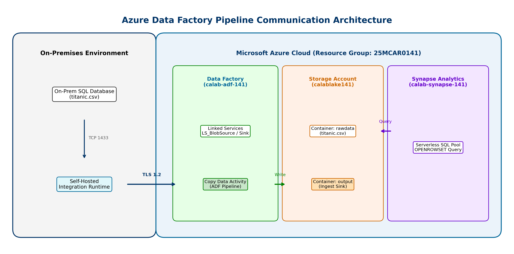
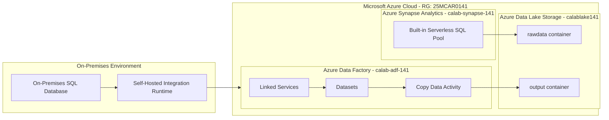

# Experiment 01: Azure Data Factory Pipeline Ingestion

> **Course Outcome**: CO1  
> **Course**: Cloud Analytics (25MCAR0141)  
> **Target Document**: [CA_Exp01_ADF_Pipeline.pdf](CA_Exp01_ADF_Pipeline.pdf)

---

## Pipeline Communication & Architecture Diagram

When data flows from the on-premises database environment into Azure Blob Storage and Synapse Analytics, the components and pipelines communicate as illustrated below:

---

## Aim & Objectives

- **Aim**: To build, configure, and execute an Azure Data Factory (ADF) pipeline to ingest data from an on-premises SQL database into Azure Blob Storage using a Self-Hosted Integration Runtime (SHIR) and validate ingestion via Azure Synapse Analytics.
- **Objectives**:
  1. Securely connect on-premises data infrastructure to Microsoft Azure using Integration Runtimes.
  2. Orchestrate cloud data ingestion workflows via Azure Data Factory Linked Services, Datasets, and Copy Data Activities.
  3. Validate and analyze ingested datasets using Azure Synapse Analytics Serverless SQL pools (`OPENROWSET`).

---

## Architecture & Component Roles

| Component | Resource Name | Role / Description |
| :--- | :--- | :--- |
| **Resource Group** | `25MCAR0141` | Logical container for all Azure experiment resources |
| **Data Factory** | `calab-adf-141` | Data integration engine executing Copy Data Activity pipelines |
| **Storage Account** | `calablake141` | ADLS Gen2 storage hosting `rawdata` and `output` Blob containers |
| **Synapse Workspace** | `calab-synapse-141` | Analytics service running Serverless SQL queries against Blob storage |
| **Integration Runtime** | `Self-Hosted IR` | Hybrid compute engine bridging on-prem SQL to cloud ADF |

---

## Step-by-Step Execution Summary

1. **Resource Provisioning**: Create Resource Group `25MCAR0141` and deploy Data Factory `calab-adf-141`, Storage Account `calablake141`, and Synapse Workspace `calab-synapse-141`.
2. **Container Setup**: Create Blob containers `rawdata` and `output` in `calablake141`. Upload source dataset `titanic.csv` into `rawdata`.
3. **Linked Services Configuration**: Create `LS_BlobSource` for reading raw storage and `LS_BlobSink` for target output writing.
4. **Dataset Setup**: Create `DS_Source` (DelimitedText pointing to `rawdata/titanic.csv` with first row as header) and `DS_Sink`.
5. **Pipeline Construction**: Drag Copy Data activity in ADF pipeline `ADF Pipeline: On-Prem SQL to Azure Blob Storage`, linking `DS_Source` to `DS_Sink`.
6. **Pipeline Run & Monitoring**: Trigger pipeline execution and verify successful run status in ADF Studio.
7. **Synapse Validation**: Open Synapse Studio (`calab-synapse-141`) and run T-SQL script using `OPENROWSET` over `titanic.csv` to verify data integrity.

---

## Lab Record PDF Document

The formal 1-page SOP notebook report and complete screenshot proof of work is available in:
**[CA_Exp01_ADF_Pipeline.pdf](CA_Exp01_ADF_Pipeline.pdf)**
